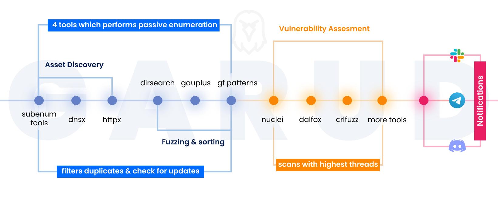

<h1 align="center">
  <br>
  <a href="https://github.com/R0X4R/Garud/"></a>
</h1>
                                                                                                                                            
<h4 align="center">An automation tool that scans sub-domains, sub-domain takeover and then filters out xss, ssti, ssrf and more injection point parameters.</h4>

<p align="center">
<a href="#"></a>
<a href="https://ko-fi.com/i/IK3K34SJSA"></a>
<a href="https://twitter.com/R0X4R/"></a>
<a href="https://github.com/R0X4R/Garud/issues"></a>
<a href="https://github.com/R0X4R/Garud/blob/master/LICENSE"></a>
<a href="#"></a>
<a href="https://github.com/R0X4R?tab=followers"></a>
</p>

---

I made this tool to automate my recon and save my time. It really give me headache always type such command and then wait to complete one command and I type other command. So I collected some of the tools which is widely used in the bugbounty field. In this script I used Assetfinder, subfinder, amass, httpx, sublister, gauplus and gf patterns and then it uses ffuf, dalfox, nuclei and kxss to find some low-hanging fruits.<br/> 

The script first enumerates all the subdomains of the give target domain using assetfinder, sublister, subfinder and amass then filters all live domains from the whole subdomain list then it extarct titles of the subdomains using httpx then it scans for subdomain takeover using nuclei. Then it uses gauplus and waybackurls to extract paramters of the given subdomains then it use gf patterns to filters xss, ssti, ssrf, sqli params from that given subdomains and then it scans for low hanging fruits as well. Then it'll save all the output in a text file like target-xss.txt. Then it will send the notifications about the scan using notify. <br/>

<p align="center">

</p>

+ **Requirements:** Go Language and Python 3.
+ **System requirements:** Recommended to run on vps with 1VCPU and 2GB ram.
+ **Tools used - You must need to install these tools to use this script**<br/>

  + [subfinder](https://github.com/projectdiscovery/subfinder)
  + [sublist3r](https://github.com/aboul3la/Sublist3r)
  + [gf patterns](https://github.com/1ndianl33t/Gf-Patterns)
  + [smuggler](https://github.com/defparam/smuggler)
  + [openRedireX](https://github.com/devanshbatham/OpenRedireX)
  + [dnsx](https://github.com/projectdiscovery/dnsx)
  + [assetfinder](https://github.com/tomnomnom/assetfinder)
  + [httpx](https://github.com/projectdiscovery/httpx)
  + [kxss](https://github.com/Emoe/kxss)
  + [qsreplace](https://github.com/tomnomnom/qsreplace)
  + [nuclei](https://github.com/projectdiscovery/nuclei)
  + [dalfox](https://github.com/hahwul/dalfox)
  + [anew](https://github.com/tomnomnom/anew)
  + [notify](https://github.com/projectdiscovery/notify)
  + [aquatone](https://github.com/michenriksen/aquatone)
  + [urldedupe](https://github.com/ameenmaali/urldedupe)
  + [amass](https://github.com/OWASP/Amass)
  + [gauplus](https://github.com/bp0lr/gauplus)
  + [crlfuzz](https://github.com/dwisiswant0/crlfuzz)
  + [ffuf](https://github.com/ffuf/ffuf)
  + [waybackurls](https://github.com/tomnomnom/waybackurls)
  
+ **Installation** - Make sure you're root before installing the tool

    ```sh
    git clone https://github.com/R0X4R/Garud.git && cd Garud/ && chmod +x garud install.sh && mv garud /usr/bin/ && ./install.sh
    ```

+ **Usage**

    ```css
    
   █▀▀ ▄▀█ █▀█ █░█ █▀▄
   █▄█ █▀█ █▀▄ █▄█ █▄▀

   coded by R0X4R in INDIA with <3

   Usage: -d       target you want to scan (target.com)
   Usage: -f       output directory where you want to save file (~/target-output/)
   Usage: -t       Add threads to get results more faster (default=100)
   Usage: -b       Add your xss server for Blind XSS (-b test.xss.ht)
   Usage: -x       Exclude out of scope domains (~/out-domains.txt)
   
   garud -d target.com -f target-output -x except.txt -t 200 -b test.xss.ht
   
    ```

+ **Fix errors while using or installing Garud**
    
    ```
    Error: ./install.sh : /bin/bash^M : bad interpretor: No such file or directory
    Fix: sed -i -e 's/\r$//' install.sh
    ```
    You can also copy the error and search on google this will make your debugging skills better ;)

  <p align="center">
  
  </p>
  <p align="center">
  ### Notifications
  
  <br/>
  <br/>
  <a href="https://www.freecodecamp.org/news/how-to-build-a-basic-slackbot-a-beginners-guide-6b40507db5c5/">Slack Bot Tutorial</a> •
  <a href="https://slack.com/intl/en-it/help/articles/115005265063-Incoming-webhooks-for-Slack">Slack Webhook for Notify</a> •
  <a href="https://github.com/projectdiscovery/notify#config-file">Configure Notify</a>
  </p>

<br>**If you like the script, [Buyme a Coffee](https://ko-fi.com/i/IK3K34SJSA)**

### Thanks to the authors of the tools used in this script.

[@aboul3la](https://github.com/aboul3la) [@tomnomnom](https://github.com/tomnomnom) [@lc](https://github.com/lc) [@hahwul](https://github.com/hahwul) [@projectdiscovery](https://github.com/projectdiscovery) [@maurosoria](https://github.com/maurosoria) [@shelld3v](https://github.com/shelld3v) [@devanshbatham](https://github.com/devanshbatham) [@michenriksen](https://github.com/michenriksen) [@defparam](https://github.com/defparam/) [@projectdiscovery](https://github.com/projectdiscovery) [@bp0lr](https://github.com/bp0lr/) [@ameenmaali](https://github.com/ameenmaali) [@dwisiswant0](https://github.com/dwisiswant0) [@OWASP](https://github.com/OWASP/) [@1ndianl33t](https://github.com/1ndianl33t) [@sqlmapproject](https://github.com/sqlmapproject) [@codingo](https://github.com/codingo/)


**Warning:** This code was originally created for personal use, it generates a substantial amount of traffic, please use with caution.
