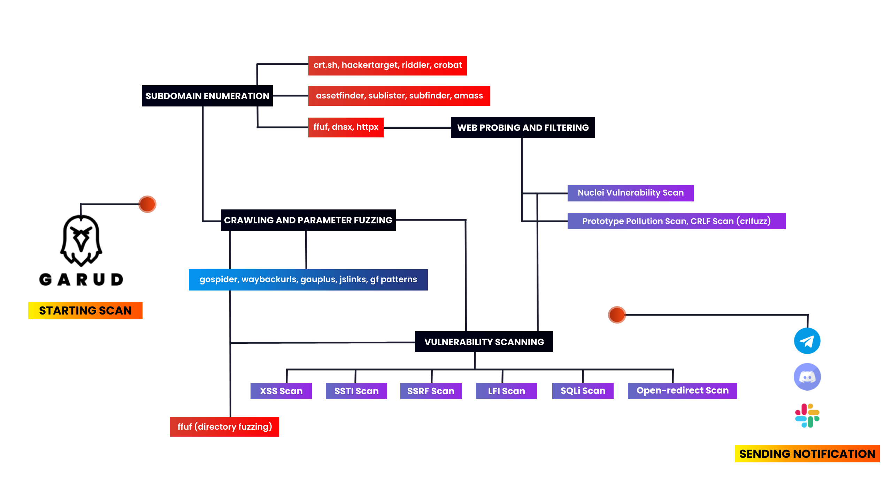
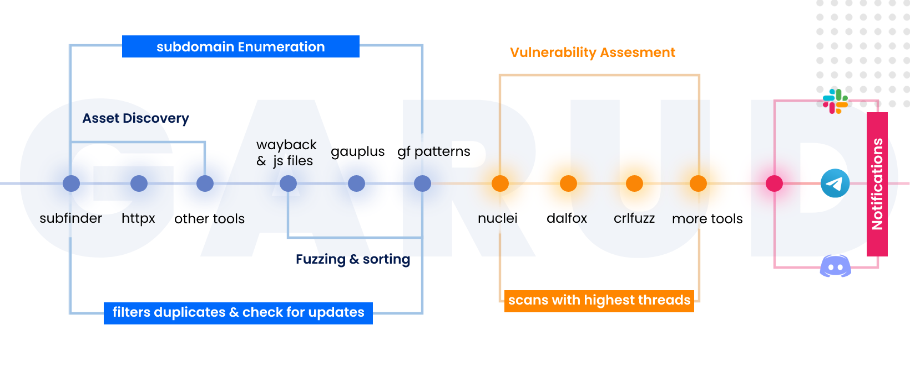

<h1 align="center">
  <br>
  <a href="https://github.com/R0X4R/Garud/"></a>
</h1>
                                                                                                                                            
<h4 align="center">An automation tool that scans sub-domains, sub-domain takeover and then filters out xss, ssti, ssrf and more injection point parameters.</h4>

<p align="center">
<a href="#"></a>
<a href="https://ko-fi.com/i/IK3K34SJSA"></a>
<a href="https://twitter.com/R0X4R/"></a>
<a href="https://github.com/R0X4R/Garud/issues"></a>
<a href="https://github.com/R0X4R/Garud/blob/master/LICENSE"></a>
<a href="#"></a>
<a href="https://github.com/R0X4R?tab=followers"></a>
</p>

---

I made this tool to automate my recon and save my time. It really give me headache always type such command and then wait to complete one command and I type other command. So I collected some of the tools which is widely used in the bugbounty field. In this script I used Assetfinder, subfinder, amass, httpx, sublister, gauplus and gf patterns and then it uses dirsearch, dalfox, nuclei and kxss to find some low-hanging fruits.<br/> 

The script first enumerates all the subdomains of the give target domain using assetfinder, sublister, subfinder and amass then filters all live domains from the whole subdomain list then it extarct titles of the subdomains using httpx then it scans for subdomain takeover using nuclei. Then it uses gauplus to extract paramters of the given subdomains then it use gf patterns to filters xss, ssti, ssrf, sqli params from that given subdomains and then it scans for low hanging fruits as well. Then it'll save all the output in a text file like target-xss.txt. Then it will send the notifications about the scan using notify. <br/>

```txt
What's new in v2.0: You can resume where you left just delete the last completed file and run the script again in the same output folder.
```

<p align="center"><br/>
<br/>

</p>

<h3>Installation</h3>

**Requirements:** Go Language and Python 3.<br>
**System requirements:** Recommended to run on vps with 1VCPU and 2GB ram.<br>

**Tools used - You must need to install these tools to use this script**<br>

  <a href="https://github.com/projectdiscovery/subfinder">`subfinder`</a> •
  <a href="https://github.com/aboul3la/Sublist3r">`sublist3r`</a> •
  <a href="https://github.com/1ndianl33t/Gf-Patterns">`gf patterns`</a> •
  <a href="https://github.com/projectdiscovery/dnsx">`dnsx`</a> •
  <a href="https://github.com/tomnomnom/assetfinder">`assetfinder`</a> •
  <a href="https://github.com/projectdiscovery/httpx">`httpx`</a> •
  <a href="https://github.com/Emoe/kxss">`kxss`</a> •
  <a href="https://github.com/tomnomnom/qsreplace">`qsreplace`</a> •
  <a href="https://github.com/projectdiscovery/nuclei">`nuclei`</a> •
  <a href="https://github.com/hahwul/dalfox">`dalfox`</a> •
  <a href="https://github.com/tomnomnom/anew">`anew`</a> •
  <a href="https://github.com/projectdiscovery/notify">`notify`</a> •
  <a href="https://github.com/michenriksen/aquatone">`aquatone`</a> •
  <a href="https://github.com/ameenmaali/urldedupe">`urldedupe`</a> •
  <a href="https://github.com/OWASP/Amass">`amass`</a> •
  <a href="https://github.com/bp0lr/gauplus">`gauplus`</a> •
  <a href="https://github.com/dwisiswant0/crlfuzz">`crlfuzz`</a> •
  <a href="https://github.com/ffuf/ffuf">`ffuf`</a> •
  <a href="https://github.com/lc/subjs">`subjs`</a> •
  <a href="https://github.com/w9w/JSA">`JSA`</a> •
  <a href="https://github.com/tomnomnom/waybackurls">`waybackurls`</a><br>


```bash
#Make sure you're root before installing the tool

garud:~ sudo su
garud:~ apt install git
garud:~ git clone https://github.com/R0X4R/Garud.git && cd Garud/ && chmod +x garud install.sh && mv garud /usr/bin/ && ./install.sh
```

<h3>Usage</h3>


```js 
[GARUD] - (v2.0) Coded by R0X4R in INDIA with <3

Example Usage:
garud [-d target.tld] [-o output destination] [-t threads] [-b blind xss URL] [-x OOS domains]

Flags:
  -d, --domain         Add your target (e.g -d target.tld)
  -o, --output         Write to output folder (e.g -o results/)
  -t, --threads        Number of threads [Default: 100] (e.g. -t 300)
  -b, --blind          Add your xss server for BXSS [Default: false] (e.g. -b test.xss.ht)
  -v, --version        Print current version of Garud
  -x, --exclude        Exclude out of scope domains [Default: false] (e.g. -x ~/oosdomains.txt)                                                    
```

**Fix errors while using or installing Garud**
    
```bash
garud:~ chmod +x install.sh && ./install.sh
Error: ./install.sh : /bin/bash^M : bad interpretor: No such file or directory
                                                    
# fix
garud:~ sed -i -e 's/\r$//' install.sh
```
You can also copy the error and search on google this will make your debugging skills better ;)

**Example Usage**

```bash
garud:~ garud -d hackerone.com -o hackerone
```
Add threads to your scan
```bash
garud:~ garud -d hackerone.com -o hackerone -t 200
```
Scan for blind xss, you can get your xss server from [xsshunter.com](https://xsshunter.com/)
```bash
garud:~ garud -d hackerone.com -o hackerone -b test.xss.ht
```
Exclude out of scope domains
```bash
garud:~ echo test.hackerone.com > ossdomain.txt
garud:~ garud -d hackerone.com -o hackerone -x ~/ossdomain.txt
```
With all flags
```bash
garud:~ garud -d hackerone.com -o hackerone -t 300 -b test.xss.ht -x ~/ossdomain.txt
```
Start where you left
```bash
garud:~ garud -d hackerone.com. -o hackerone -t 300
Starting scan...
^C # assume you stopped at nuclei scan
garud:~ cd hackerone && rm -rf nuclei
garud:~ cd
garud:~ garud -d hackerone.com. -o hackerone -t 300
```

<h3>Notifications</h3>
<p align="left">
<a href="https://slack.com/intl/en-it/help/articles/115005265063-Incoming-webhooks-for-Slack">Slack Notification BOT</a> •
<a href="https://support.discord.com/hc/en-us/articles/228383668-Intro-to-Webhooks">Discord Notification BOT</a> •
<a href="https://core.telegram.org/bots#3-how-do-i-create-a-bot">Telegram Notification BOT</a> •
<a href="https://github.com/projectdiscovery/notify#config-file">Configure Notify</a>
</p>
                                                                
<p align="left">
<h3>Donate</h3> 
<a href="https://ko-fi.com/i/IK3K34SJSA"></a>
</p>

### Thanks to the authors of the tools used in this script.

[@aboul3la](https://github.com/aboul3la) [@tomnomnom](https://github.com/tomnomnom) [@lc](https://github.com/lc) [@hahwul](https://github.com/hahwul) [@projectdiscovery](https://github.com/projectdiscovery) [@maurosoria](https://github.com/maurosoria) [@shelld3v](https://github.com/shelld3v) [@devanshbatham](https://github.com/devanshbatham) [@michenriksen](https://github.com/michenriksen) [@defparam](https://github.com/defparam/) [@projectdiscovery](https://github.com/projectdiscovery) [@bp0lr](https://github.com/bp0lr/) [@ameenmaali](https://github.com/ameenmaali) [@dwisiswant0](https://github.com/dwisiswant0) [@OWASP](https://github.com/OWASP/) [@1ndianl33t](https://github.com/1ndianl33t) [@sqlmapproject](https://github.com/sqlmapproject) [@w9w](https://github.com/w9w)


**Warning:** This code was originally created for personal use, it generates a substantial amount of traffic, please use with caution.
